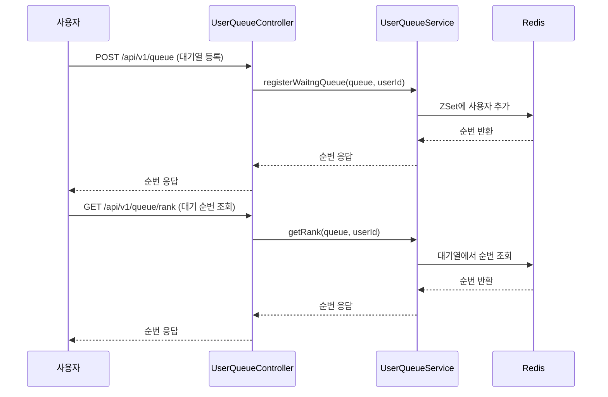
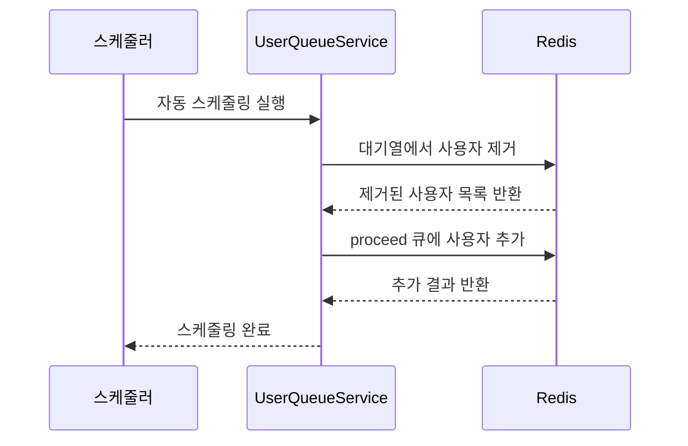
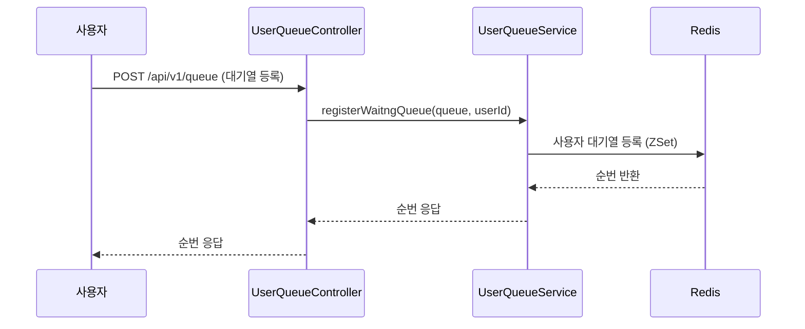
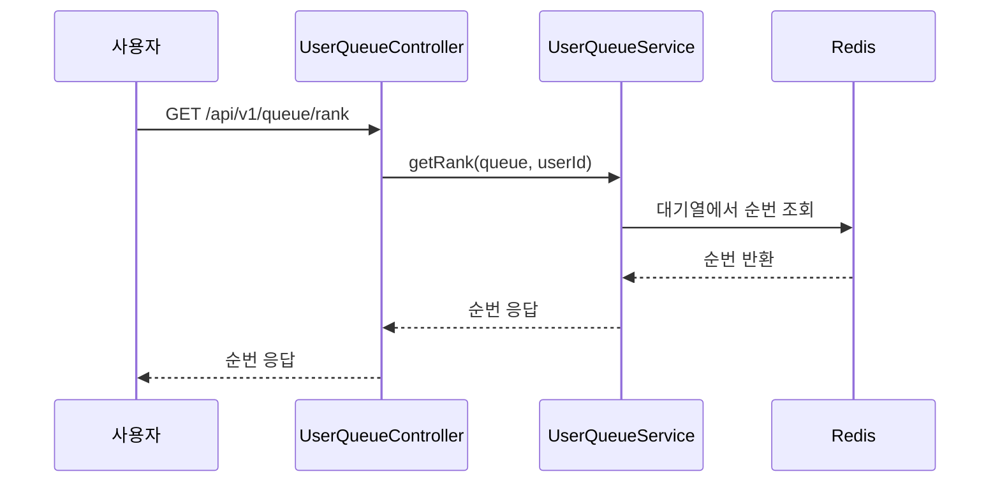
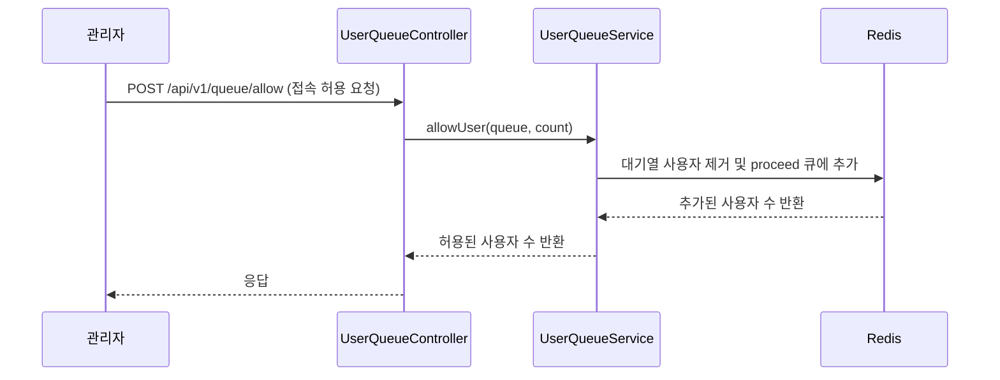
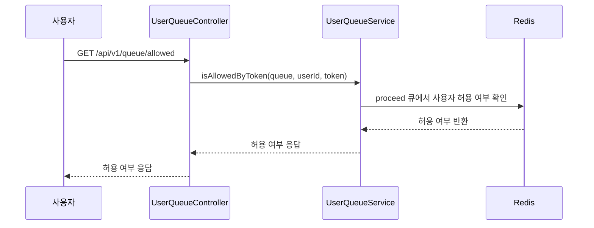
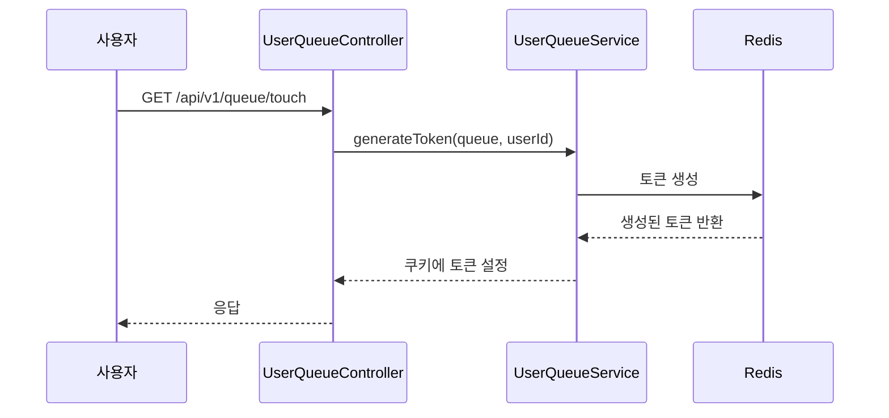

### README.md 파일 작성

---

## 접속자 대기열 시스템

### 소개
이 프로젝트는 짧은 시간 동안 대량의 트래픽을 처리할 수 있는 **접속자 대기열 시스템**을 구현하는 것을 목표로 합니다. **Spring WebFlux**, **Redis**, **R2DBC**를 사용하여, 순차적으로 대기열에 들어온 요청을 관리하고, 서버 부하를 줄이기 위해 사용자 접속을 제어합니다.

[접속자대기열시스템#1요구사항.pptx](https://github.com/user-attachments/files/17328071/1.pptx)
[접속자대기열시스템#2아키텍처.pptx](https://github.com/user-attachments/files/17328074/2.pptx)

### 주요 기능
- **대기열 등록 및 순번 부여**: 사용자를 대기열에 등록하고 순번을 관리합니다.
- **접속 허용**: 순서에 따라 사용자 접속을 허용합니다.
- **대기열 상태 확인**: 현재 대기 중인 순번과 접속 허용 여부를 확인합니다.
- **자동 스케줄링**: 정해진 간격으로 대기열 사용자 중 일부를 자동으로 허용합니다.

### 설치 및 실행

1. **의존성 설치**
   아래의 필수 의존성이 필요합니다:
- Java 17 이상
- Gradle 또는 Maven
- Docker (Redis 설치)

2. Redis 실행
   시스템은 Redis를 사용하므로, Docker를 통해 Redis를 실행할 수 있습니다.
```bash
docker run -d -p 6379:6379 redis
```
3. **애플리케이션 실행**

```bash
# Gradle 사용 시
./gradlew bootRunAll

# Maven 사용 시
mvn spring-boot:run
```

### 시스템 구성도
#### 사용자 대기 등록 및 순번 조회



#### 접속 허용 및 자동 스케줄링



### 엔드포인트 시퀀스 다이어그램 
여기서는 각 엔드포인트 별로 흐름도를 Meridmaid로 표현하여, 전체 시스템의 흐름을 이해할 수 있도록 하겠습니다.

#### 1. `/api/v1/queue` (대기열 등록)


#### 2. `/api/v1/queue/rank` (대기 순번 조회)


#### 3. `/api/v1/queue/allow` (접속 허용)


#### 4. `/api/v1/queue/allowed` (접속 허용 여부 확인)


#### 5. `/api/v1/queue/touch` (접속 유지)



### 라이센스
이 프로젝트는 MIT 라이센스에 따라 배포됩니다.

